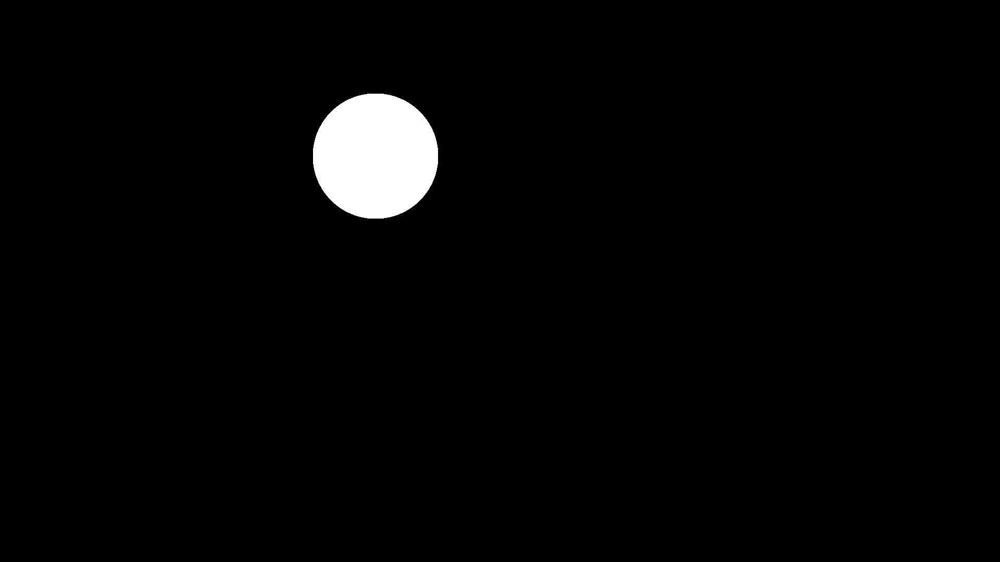
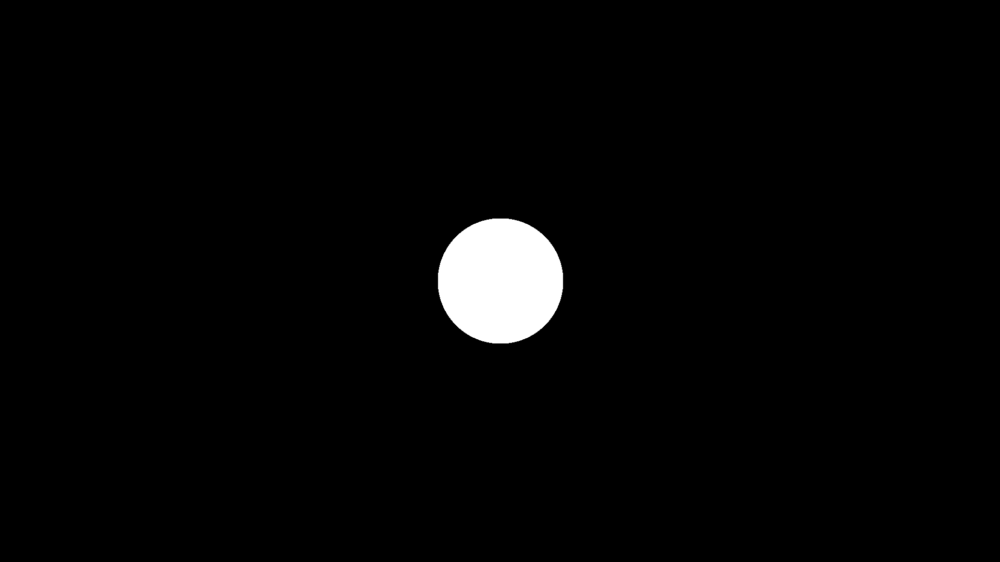

# A Simple Smear

Animations are made by stitching together a series of images to give the illusion of motion.
When creating an animation, we can choose the number of images we show to our viewers every second.
Cinematic movies are typically shown at 24 frames per second (fps).
Video games do not usually have a set fps value, but most people usually prefer 60 or higher.
Youtube videos can be set to whatever you want, but I typically prefer either 30 or 60 depending on the situation.

Now here's a weird quirk of the human brain.
Old-school animations are usually 24 fps, but seem incredibly smooth.
If you play a video game at 24 fps, it can sometimes be nauseating.

Why?

Well, there is no hard answer to this, but video game engines are tasked at showing sometimes thousands of objects to you in real time.
This is a really demanding process for your graphics card, so engines will do whatever they can to render things as quickly as possible while still being correct.
Even worse for the game engine, it does not always know it's next frame because it has to take the actions of the player into account.

This is starkly contrasting the animation industry where it might take days to draw even a single frame.
Because the entire movie has been drawn on a storyboard before-hand, the artists know what to draw and how to guide the viewer to the next important scene.
After months of hard work, all the animators come together and coalesce their art into the final video.

So let's compare and contrast the difference between these two approaches.
If a game engine is given 3 frames to move a circle from the upper left to lower right of the screen, it will render the circle at the start and end location along with the intermediary frames, like so:

| Frame 1 | Intermediate Frame | Final Frame |
| ------- | ------------------ | ----------- |
|  |  |  |

Animators will do things a little differently.
The start and end will look the same, but the intermediary frame will be squashed to show the direction of motion:

| Frame 1 | Intermediate Frame | Final Frame |
| ------- | ------------------ | ----------- |
|  |  |  |

The intermediary frame is called a smear frame and this technique is used almost everywhere in modern animation.
If you have ever seen a really smooth animation, it's probably because there were really good smears between different character positions.
Smear frames are also why characters might look a little weird when you pause an animated video at the wrong place.

Simply put: if an animation lacks smear frames, it might start to look like a low fps video game.
We want to avoid that as best as we can!

So, let's get to it!

## Example

To start, I will create a function that use the `num_particles`, and `num_iterations` for the naive chaos game kernel.
Note in this case, I am also using `AT` for the Array Type (`Array` for CPU or `CuArray` for GPU), and `num_frames` for the total number of frames.
Finally, I will create an `output_type` variable that can be either `:video`, or `:image` to output to video (`out.mp4`) or images (`check*.png`):

```
using Fae, CUDA

function main(num_particles, num_iterations, total_frames, AT;
              output_type = :video)

```

Now I will define the image and video parameters:

```
    # define image domain
    res = (1080, 1920)
    bounds = [-4.5 4.5; -8 8]
    layer = FractalLayer(res; AT = AT, logscale = false, FT = FT)

    # defining video parameters
    if output_type == :video
        video_out = open_video(res; framerate = 30, filename = "out.mp4",
                               encoder_options = (crf=23, preset="medium"))
    end

```

Note that the video will stitch together a series of frames, so we still need the pixels from `layer` hanging around.
Now we define the ball:

```
    # define ball parameters
    radius = 1.0
    pos = [-2.0, -2.0]

    ball = define_circle(pos, radius, (1,1,1); AT = AT)
```

And now we start getting ready for the smear frame transformation:

```
    # fractal inputs to track changes in position, scale, and theta for smear 
    object_position = fi("object_position", pos)
    scale = fi("scale", (1,1))
    theta = fi("theta", 0)

    fis = [object_position, scale, theta]
    
    # first defining the fractal user method
    smear = Smears.stretch_and_rotate(object_position = object_position,
                                      scale = scale, theta = theta)

    # now turning it into a fractal operator
    smear_transform = fee([FractalOperator(smear)], fis; name = "smear",
                          final = true, diagnostic = true)
```

For this, we are creating fractal inputs (`object_position`, `scale`, and `theta`) for the `stretch_and_rotate` fractal user method. We then turn this into a fractal operator.
Note that fractal inputs are good for when you need to update the value of certain parameters on the fly.
For clarity, here is the `stretch_and_rotate` fractal user method:

```
stretch_and_rotate = @fum function stretch_and_rotate(
    x,y;
    object_position = (0,0),
    scale = (1,1),
    theta = 0)

    y = (y - object_position[1])*scale[1]
    x = (x - object_position[2])*scale[2]

    temp_x = x*cos(theta) - y*sin(theta)
    temp_y = x*sin(theta) + y*cos(theta)

    x = temp_x + object_position[2]
    y = temp_y + object_position[1]
end

```

Finally, we have the animation loop:

```
    for i = 1:total_frames

        # changing ball position
        radius = 1.0
        pos = [-2.0+4*(i-1)/(total_frames-1),
               -2.0+4*(i-1)/(total_frames-1)]

        update_circle!(ball, pos, radius)

        # creating a value that grows as it gets closer to total_frames / 2
        # and shrinks as it gets closer to total_frames
        scale_x = 2 - abs((i-1)*2-(total_frames-1))/(total_frames-1)

        # modifying fractal inputs for smear
        object_position = set(object_position, pos)
        scale = set(scale, (1,scale_x))
        theta = set(theta, pi/4)

        update_fis!(smear_transform, [object_position, scale, theta])
        fractal_flame!(layer, ball, smear_transform, num_particles,
                       num_iterations, bounds, res;
                       AT = AT, FT = FT)

        if output_type == :video
            write_video!(video_out, [layer])
        elseif output_type == :image
            filename = "check"*lpad(i,5,"0")*".png"
            write_image([layer], filename)
        end

        # clearing frame
        zero!(layer)
    end

```

This does 4 things:
1. It updates the circle at every step.
2. It re`set`s the `object_position`, `scale`, and `theta` for the `smear_trasnform`.
3. It outputs to either video or image.
4. It sets the canvas values back to 0 for the next frame

Once this is done, all we need to do is close the video (if we were outputting to video at all:

```
    if (output_type == :video)
        close_video(video_out)
    end

```

If we run `main(10000, 10000, 10, CuArray; output_tupe = :video)`, we will get the following video:


## Just the code

And here is the full code:
```
using Fae, CUDA

function main(num_particles, num_iterations, total_frames, AT;
              output_type = :video)
    FT = Float32

    # define image domain
    res = (1080, 1920)
    bounds = [-4.5 4.5; -8 8]
    layer = FractalLayer(res; AT = AT, logscale = false, FT = FT)

    # defining video parameters
    if output_type == :video
        video_out = open_video(res; framerate = 30, filename = "out.mp4",
                               encoder_options = (crf=23, preset="medium"))
    end

    # define ball parameters
    radius = 1.0
    pos = [-2.0, -2.0]

    ball = define_circle(pos, radius, (1,1,1); AT = AT)

    # fractal inputs to track changes in position, scale, and theta for smear 
    object_position = fi("object_position", pos)
    scale = fi("scale", (1,1))
    theta = fi("theta", 0)

    fis = [object_position, scale, theta]
    
    # first defining the fractal user method
    smear = Smears.stretch_and_rotate(object_position = object_position,
                                      scale = scale, theta = theta)

    # now turning it into a fractal operator
    smear_transform = fee([FractalOperator(smear)], fis; name = "smear",
                          final = true, diagnostic = true)

    for i = 1:total_frames

        # changing ball position
        radius = 1.0
        pos = [-2.0+4*(i-1)/(total_frames-1),
               -2.0+4*(i-1)/(total_frames-1)]

        update_circle!(ball, pos, radius)

        # creating a value that grows as it gets closer to total_frames / 2
        # and shrinks as it gets closer to total_frames
        scale_x = 2 - abs((i-1)*2-(total_frames-1))/(total_frames-1)

        # modifying fractal inputs for smear
        object_position = set(object_position, pos)
        scale = set(scale, (1,scale_x))
        theta = set(theta, pi/4)

        update_fis!(smear_transform, [object_position, scale, theta])
        #fractal_flame!(layer, ball, smear_transform, num_particles,
        fractal_flame!(layer, ball, num_particles,
                       num_iterations, bounds, res;
                       AT = AT, FT = FT)

        if output_type == :video
            write_video!(video_out, [layer])
        elseif output_type == :image
            filename = "check"*lpad(i,5,"0")*".png"
            write_image([layer], filename)
        end

        # clearing frame
        zero!(layer)
    end

    if (output_type == :video)
        close_video(video_out)
    end

end
```
