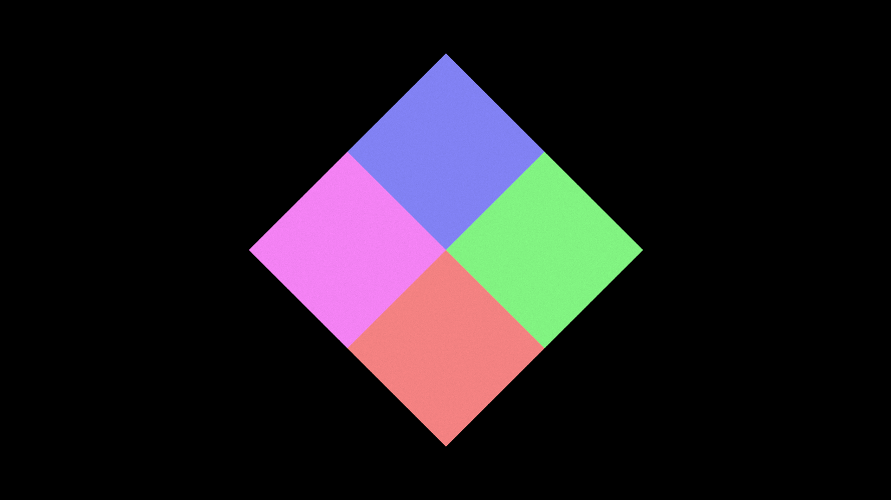
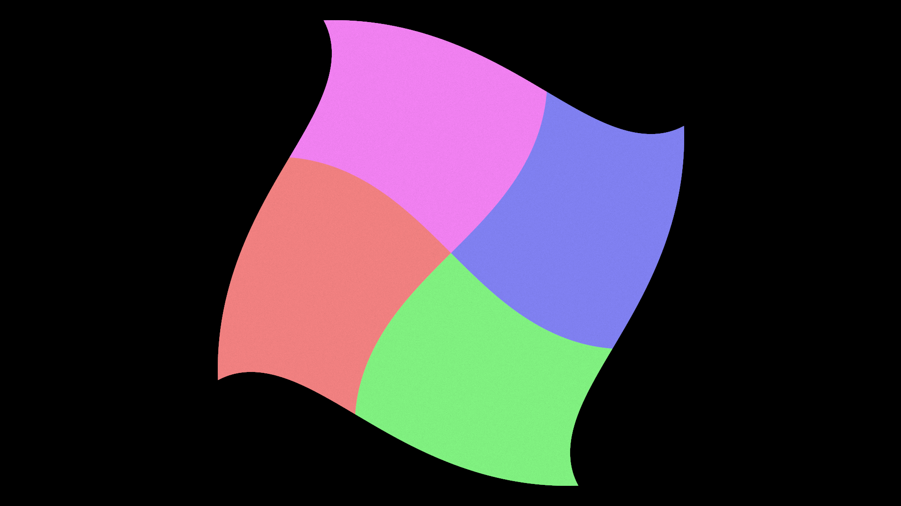
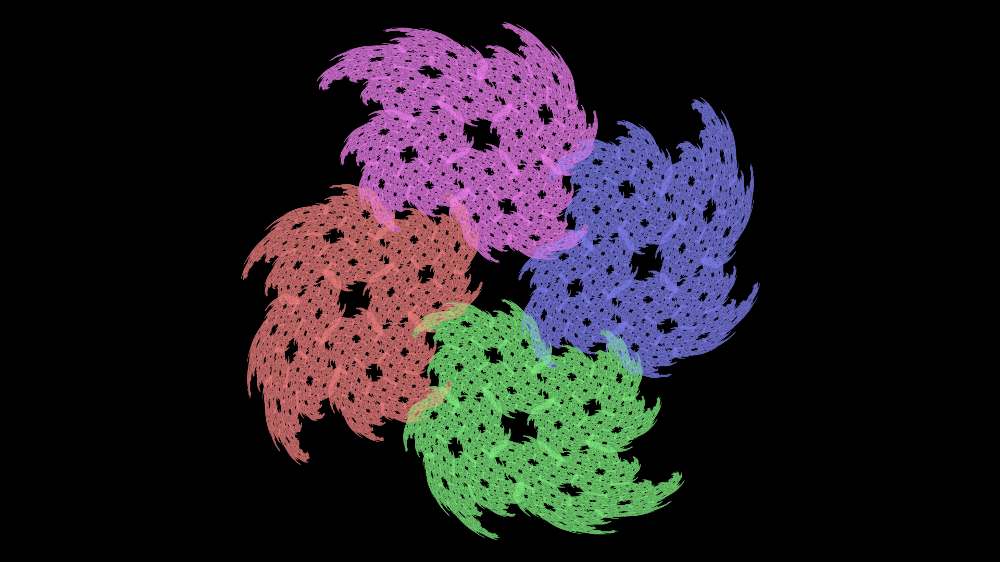

# A Swirled Square

This is a quick example to show how to use Fae.jl

## Step 1: create a square

First, we should create a square.
To do this, we need to set up Fae with the right parameters:

```
    # Physical space location. 
    bounds = [-4.5 4.5; -8 8]*0.15

    # Pixel grid
    res = (1080, 1920)

    # parameters for initial square
    pos = [0.0, 0.0]
    rotation = pi/4
    scale_x = 1.0
    scale_y = 1.0
```

Note that this sets up an image resolution, `res`, and a separate camera with physical units, `bounds`, so if we are using a 1920 by 1080 image, the `bounds` can be anything with a 16:9 ratio.
Here, we also set the position, `pos`, the `rotation`, and scaling factors in x and y, `scale_x` and `scale_y`.

Now we need to define a color.
This can be done by passing in an array or tuple (such as `color = [1.0, 0, 0, 1]` for red), or as an array of arrays or tuples, like:

```
    colors = [[1.0, 0.25, 0.25,1],
              [0.25, 1.0, 0.25, 1],
              [0.25, 0.25, 1.0, 1],
              [1.0, 0.25, 1.0, 1]]

```

In this case, each row of the array will define the color of a different quadrant of the square.
Now we can define our fractal executable...

```
H = define_rectangle(pos, rotation, scale_x, scale_y, colors)
```

Here, `ArrayType` can be either an `Array` or `CuArray` depending whether you would like to run the code on the CPU or (CUDA / AMD) GPU.
`num_particles` and `num_iterations` are the number of points we are solving with for the chaos game and the number of iterations for each point.
The higher these numbers are, the better resolved our final image will be.
Notationally, we are using the variable `H` to designate a Hutchinson operator, which is the mathematical name for a function set.

Finally, we need to attach this function to the layer and run everything with the `run!(...)` function and write it to an image:

```
    layer = FractalLayer(res; ArrayType = ArrayType, logscale = false,
                         FloatType = FloatType, H1 = H,
                         num_particles = num_particles,
                         num_iterations = num_iterations)

    run!(layer, bounds)

    write_image([layer]; filename = "out.png")

```

Note that the `H1 = H` keyword argument is the one actually defining `H` as the first Hutchinson operator for the `FractalLayer`.
After running this, we will get the following image:



The full code will look like 

```
function main(num_particles, num_iterations, ArrayType; dark = true)
    FloatType = Float32

    # Physical space location. 
    bounds = [-4.5 4.5; -8 8]*0.15

    # Pixel grid
    res = (1080, 1920)

    # parameters for initial square
    pos = [0.0, 0.0]
    rotation = pi/4
    scale_x = 1.0
    scale_y = 1.0

    if dark
        colors = [[1.0, 0.25, 0.25,1],
                  [0.25, 1.0, 0.25, 1],
                  [0.25, 0.25, 1.0, 1],
                  [1.0, 0.25, 1.0, 1]]
    else
        colors = [[1.0, 0, 0,1],
                 [0, 1.0, 0, 1],
                 [0, 0, 1.0, 1],
                 [1.0, 0, 1.0, 1]]
    end

    H = define_rectangle(pos, rotation, scale_x, scale_y, colors)

    layer = FractalLayer(res; ArrayType = ArrayType, logscale = false,
                         FloatType = FloatType, H1 = H,
                         num_particles = num_particles,
                         num_iterations = num_iterations)

    run!(layer, bounds)

    write_image(layer; filename = "out.png")


end

```

## Step 2: swirl the square

Next, we will try to "swirl the square" by also adding another fractal executable to the mix, the swirl operator (defined already in Fae.jl):

```
swirl = @fum function swirl(x, y)
    r = sqrt(y*y + x*x)

    v1 = x*cos(r*r) + y*sin(r*r)
    v2 = x*sin(r*r) - y*cos(r*r)

    y = v1
    x = v2
end
```

Here, we are using the `@fum` syntax to show how users might define their own operators.
The same can be done for colors.

The code here does not change significantly, except that we create a `H2` and add it to the `fractal_flame(...)` function:

```
...
    H2 = Hutchinson([Flames.swirl],
                    [Fae.Colors.previous],
                    (1.0,);
                    final = true, diagnostic = true, name = "2")

    layer = FractalLayer(res; ArrayType = ArrayType, logscale = false,
                         FloatType = FloatType, H1 = H, H2 = H2,
                         num_particles = num_particles,
                         num_iterations = num_iterations)

    run!(layer, bounds)
...
```

There are a few nuances to point out:

1. We are using `Fae.Colors.previous`, which simply means that the swirl will use whatever colors were specified in `H1`.
2. Fractal operators can be called with `fee` or `Hutchinson` and require `Array` or `Tuple` inputs.
3. `final = true`, means that this is a post processing operation. In other words, `H1` creates the object primitive (square), and `H2` always operates on that square.
4. We are specifying the Floating Type, `FloatType`, as `Float32`, but that is not necessary.

Once this is run, it should provide the following image:



## Step 3: a different kind of swirl

Now some people might be scratching their heads at the previous result.
If we are solving with both `H1` and `H2`, why does it look like two separate actions instead of one combined one?
In other words, why is the swirl so clearly different than the square operation?

This is because we operate on two separate sets of points.
`H1` creates object primitives. Every step of the simulation, we will read from the points after `H1` operates on them.
`H2` works on a completely different location in memory specifically for image output.
If we want, we can make `H2` operate on the object, itself, by creating a new fractal executable:

```
    final_H = fee([H, H2])

    layer = FractalLayer(res; ArrayType = ArrayType, logscale = false,
                         FloatType = FloatType, H1 = final_H
                         num_particles = num_particles,
                         num_iterations = num_iterations)

    run!(layer, bounds)

```

which will create the following image:



Here, again, is the full code:

```
function main(num_particles, num_iterations, ArrayType; dark = true)
    FloatType = Float32

    # Physical space location. 
    bounds = [-4.5 4.5; -8 8]*0.15

    # Pixel grid
    res = (1080, 1920)

    # parameters for initial square
    pos = [0.0, 0.0]
    rotation = pi/4
    scale_x = 1.0
    scale_y = 1.0

    if dark
        colors = [[1.0, 0.25, 0.25,1],
                  [0.25, 1.0, 0.25, 1],
                  [0.25, 0.25, 1.0, 1],
                  [1.0, 0.25, 1.0, 1]]
    else
        colors = [[1.0, 0, 0,1],
                 [0, 1.0, 0, 1],
                 [0, 0, 1.0, 1],
                 [1.0, 0, 1.0, 1]]
    end

    H = define_rectangle(pos, rotation, scale_x, scale_y, colors; ArrayType = ArrayType)
    H2 = Hutchinson([Flames.swirl],
                    [Fae.Colors.previous],
                    (1.0,);
                    diagnostic = true, ArrayType = ArrayType, name = "2")
    final_H = fee([H, H2])

    layer = fractal_flame(final_H, num_particles, num_iterations,
                          bounds, res; ArrayType = ArrayType, FloatType = FloatType)

    filename = "out.png"
    write_image([layer], filename)
end

```
