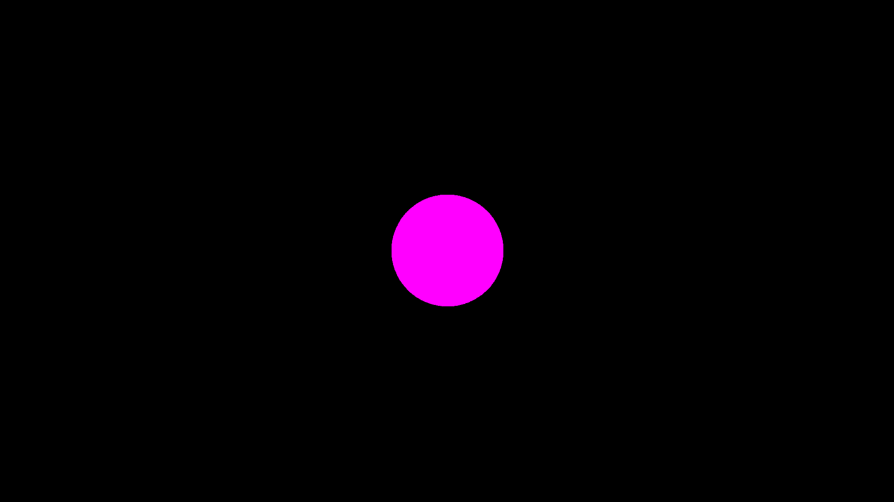
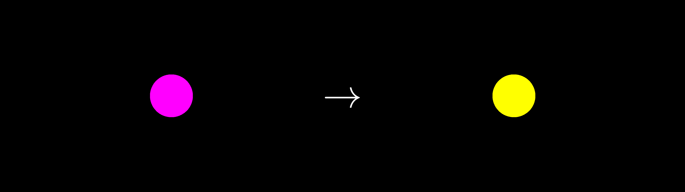
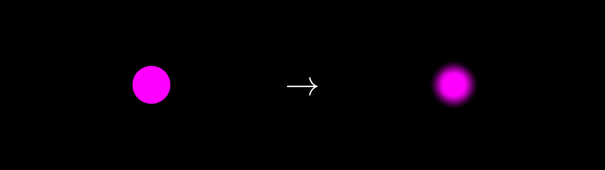
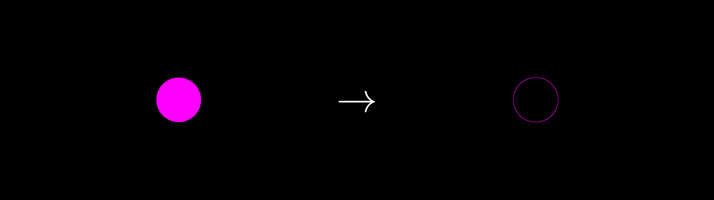
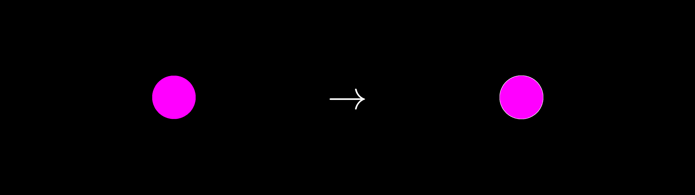

# Post processing

Once you have generated an image via any of the provided Fable Executables (such as Colors, Shaders, or Hutchinson operators), you may want to do additional operations before writing to file.
Right now, we support the following operations:

* **Clipping**: This is the process of turning any pixel above a given threshold intensity into another desired color.
* **Filtering**: This is essentially a convolution with a provided filter, for effects like a Gaussian blur.
* **Sobel**: This is a Sobel filter (without directional information). It is useful for edge detection or simple outlines.
* **Outlines**: This takes the Sobel information and turns it into a more distinct outline.

In this discussion, I will also describe how you may write your own post processing option, if you want.
All the examples can be found in `examples/postprocessing.md`.

## General Notes

The `postprocess!(...)` function is called when using `write_image(...)` or `write_video(...)`.
This means that the post processing step happens after the all FableExecutables have been `run(...)`.
Importantly, all post processing steps act exclusively on the `canvas` for each `AbstractLayer` type.
Each `canvas` is essentially an `Array` (`CuArray` or `ROCArray`) of `RGBA` values that are initialized before post processing occurs.
Each post processing step is performed in the order they are added to the `postprocessing_steps` `Vector` in each `AbstractLayer`.

There is no default post process for `Shader` and `Color` layers, which essentially means that no post process will be performed unless specified by the user.
For `FableLayer`s, there is always a `CopyToCanvas(...)` post process, which essentially takes the `RGBA` information from the `run(...)` function and turns it into a `canvas` for later post processing steps.
In practice, this is a small discrepancy that users should not need to worry about.

For the following examples, we will be performing post processing on a simple circle created via a FableExecutable:

```
function quick_circle(num_particles, num_iterations; ArrayType = Array,
                      filename = "out.png")
    circle = create_circle(; radius = 0.1, color = [1, 0, 1, 1])

    fl = FableLayer(; H1 = circle, ArrayType = ArrayType)

    run!(fl)
    write_image(fl; filename = filename)
end
```

This will create a pink circle that looks like this:



## Clipping

By default, the `Clip` post process will turn any `RGBA` value above a pre-defined `threshold` to another designated color; however, you can change the `clip_op`(clip operator) to use any function instead of `>`.
You may also change how the intensity is calculated by passing in an `intensity_function` argument.
Fable.jl currently supports the following intensity functions:

```
@inline function simple_intensity(c::CT) where CT <: Union{RGB}
   return (c.r/3) + (c.g/3) + (c.b/3)
end
```
and

```
@inline function perceptive_intensity(c::CT) where CT <: Union{RGBA}
    return c.alpha * ((0.21 * c.r) + (0.72 * c.g) + (0.07 * c.b))
end
```
The latter is meant to more realistically portray to how humans perceive light.

The `Clip` post process can be created like so:

```
clip = Clip(; threshold = 0.5, color = RGBA(0,0,0,1),
              intensity_function = simple_intensity, clip_op = >)
```

Note that the key word arguments above are also the defaults for the `Clip` post process.
Here is a quick example:

```
function clip_example(num_particles, num_iterations; ArrayType = Array,
                      filename = "clip_out.png")

    circle = create_circle(; radius = 0.1, color = [1, 0, 1, 1])

    clip = Clip(; threshold = 0.5, color = RGBA(1, 1, 0, 1))

    fl = FableLayer(; H1 = circle, ArrayType = ArrayType,
                        postprocessing_steps = [clip])

    run!(fl)
    write_image(fl; filename = filename)
end
```

This will turn our pink ball yellow:



## Filtering

The `Filter` post process essentially performs a convolution with a provided filter.
Convolutions are somewhat complicated to understand, but if you want to learn more, please check out the chapter(s) available on the [Algorithm Archive](https://www.algorithm-archive.org/contents/convolutions/convolutions.html).
All the necessary information for understanding how this post process works can be found there, along with an example using the `Sobel` operator.

By default, Fable.jl provides the following filters:

**Identity**: This is a test filter and just returns the exact image back
```
function Identity(; filter_size = 3, ArrayType = Array)
    if iseven(filter_size)
        filter_size = filter_size - 1
        @warn("filter sizes must be odd! New filter size is " *
              string(filter_size)*"!")
    end
    filter = zeros(filter_size, filter_size)
    idx = ceil(Int, filter_size*0.5)
    filter[idx, idx] = 1

    return Filter(filter!, ArrayType(filter), nothing, false)
end

```

**Gaussian** / **Blur**: these perform a Gaussian blur of the image.
```
function gaussian(x,y, sigma)
    return (1/(2*pi*sigma*sigma))*exp(-((x*x + y*y)/(2*sigma*sigma)))
end

function Blur(; filter_size = 3, ArrayType = Array, sigma = 1.0)
    return Gaussian(; filter_size = filter_size, ArrayType = ArrayType,
                      sigma = sigma)
end

function Gaussian(; filter_size = 3, ArrayType = Array, sigma = 1.0)
    if iseven(filter_size)
        filter_size = filter_size - 1
        @warn("filter sizes must be odd! New filter size is " *
              string(filter_size)*"!")
    end
    if filter_size > 1
        filter = zeros(filter_size, filter_size)
        for i = 1:filter_size
            y = -1 + 2*(i-1)/(filter_size-1) 
            for j = 1:filter_size
                x = -1 + 2*(j-1)/(filter_size-1) 
                filter[i,j] = gaussian(x, y, sigma)
            end
        end
    else
        filter = [1.0]
    end

    filter ./= sum(filter)
    return Filter(filter!, ArrayType(filter), nothing, false)
end
```
The `Sobel` post process also uses a `Filter`, but it will be discussed separately in the next section.

The only important note here is that because users are creating kernels themselves, it is possible to accidentally create a kernel of a different `ArrayType` than the layer's `canvas`.
In this case, the kernel will change the array type of the filter and provide the following warning:

```
Info: filter array type not the same as canvas!
Converting filter to canvas type...
```

Finally, here is a quick example using the Gaussian `Blur` post process (note you can also use the same post process by calling `Gaussian` instead in the same way):

```
function blur_example(num_particles, num_iterations; ArrayType = Array,
                      filter_size = 3, filename = "blur_out.png")
    circle = create_circle(; radius = 0.1, color = [1, 0, 1, 1])

    blur = Blur(; filter_size = filter_size)

    fl = FableLayer(; H1 = circle, ArrayType = ArrayType,
                        postprocessing_steps = [blur])

    run!(fl)
    write_image(fl; filename = filename)
end
```

This will produce the following image when using a $$100\times 100$$ filter:



## Sobel operator

The Sobel operator is often called an "image derivative."
More information can be found on the [Algorithm Archive](https://www.algorithm-archive.org/contents/convolutions/2d/2d.html).
In general, this operation can be split into 3 steps:
1. A gradient in the $$x$$ direction ($$G_x$$)
2. A gradient in the $$y$$ direction ($$G_y$$)
3. A sum of both gradients: $$\sqrt{G_x^2 + G_y^2}$$

As an important note, many implementations of the Sobel operator also return gradient direction information.
This part of the operation is not performed in Fable.jl by default.

Here is a quick example using the Sobel operator:
```
function sobel_example(num_particles, num_iterations; ArrayType = Array,
                       filename = "sobel_out.png")
    circle = create_circle(; radius = 0.1, color = [1, 0, 1, 1])

    sobel = Sobel()

    fl = FableLayer(; H1 = circle, ArrayType = ArrayType,
                        postprocessing_steps = [sobel])

    run!(fl)
    write_image(fl; filename = filename)
end
```

This will produce the following image:



## Outlines

Outlines are surprisingly tricky to get right.
I will not argue that the `Outline` implementation in Fable.jl is perfect, but it works well enough for now.

The current implementation was inspired by Canny edge detection and does the following:
1. Blurs the given image by some factor related to the user-provided `linewidth` variable.
2. Performs a Sobel operation on the image to get the image derivative.
3. Performs naive ridge detection, which sets any value in the Sobel-operated canvas above a certain threshold to be the provided outline `color`. This is essentially a `Clip` post process from above.

There are a bunch of key word arguments you can use for `Outline`:

```
outline = Outline(; linewidth = 1,
                   color = RGBA(1.0, 1.0, 1.0, 1.0),
                   intensity_function = simple_intensity,
                   object_outline = false,
                   threshold = 1/(linewidth*linewidth+1),
                   sigma = 1)

```

Here, `linewidth` is the desired line width of the outline, `color` is the desired color, `intensity_function` is the intensity function as described in the `Clip` subsection above, `threshold` is used for ridge detection, and `sigma` defines the width of the Gaussian for the blur kernel.
The only tricky argument is `object_outline`, which is specifically for FableLayers.
It indicates that the user wants to outline the fractal object, itself, not any inner components from potentially using a `FableUserMethod` for coloring the fractal object.

Here is a quick example using the Outline post process:
```
function outline_example(num_particles, num_iterations; ArrayType = Array,
                         filename = "outline_out.png", linewidth = 1,
                         object_outline = false)
    circle = create_circle(; radius = 0.1, color = [1, 0, 1, 1])

    outline = Outline(; linewidth = linewidth, object_outline = object_outline)

    fl = FableLayer(; H1 = circle, ArrayType = ArrayType,
                        postprocessing_steps = [outline])

    run!(fl)
    write_image(fl; filename = filename)
end
```

This will produce the following image:



## Building your own

Finally, we will touch on what is necessary to build a post process from scratch.
Right now, this can be done by creating a new `AbstractPostProcess` struct, similar to those used in the above examples.
Here is the `Clip` post processing struct for reference:

```
struct Clip <: AbstractPostProcess
    op::Function
    clip_op::Function
    intensity_function::Function
    threshold::Number
    color::CT where CT <: Union{RGB, RGBA}
    initialized::Bool
end
```

To be honest, this part of the code is a little sticky right now, so feel free to try to clean it up in a PR, but the minimal `AbstractPostProcess` struct would look like this:

```
struct Minimal <: AbstractPostProcess
    op::Function
    initialized::Bool
end
```

Here, `op` is the provided function the `AbstractPostProcess` should use, while `initialized` is a boolean value indicating whether the post process needs initialization.
This is useful for post processes that require additional `canvas` parameters, like the `Filter` post process:

```
mutable struct Filter <: AbstractPostProcess
    op::Function
    filter::AT where AT <: Union{Array, CuArray, ROCArray}
    canvas::AT where AT <: Union{Array, CuArray, ROCArray, Nothing}
    initialized::Bool
end
```

If `initialized` is set to `false`, the `initialize!(...)` function will be called when using the post process for the first time.
Here is the `initialize!(...)` function for `Filter`:

```
function initialize!(filter::Filter, layer::AL) where AL <: AbstractLayer
    ArrayType = layer.params.ArrayType
    if !(typeof(filter.filter) <: layer.params.ArrayType)
        @info("filter array type not the same as canvas!\nConverting filter to canvas type...")
        filter.filter = ArrayType(filter.filter)
    end
    filter.canvas = ArrayType(zeros(eltype(layer.canvas), size(layer.canvas)))
end
```

Note that all `initialize!` functions should have the args `(filter::Filter, layer::AL)`.
In practice, these functions are usually used to make sure that the post process canvas has the same `ArrayType` and size as the layer.

As a final note: when designing an `op` function to be used for each post process, remember that the `ArrayType` could be a `CuArray` or `ROCArray`, so try to make the functions GPU friendly.
This is why many of the post processes are written in KernelAbstractions.

Again, this part of the code is sticky, so if you need to add another post process, feel free to create an issue and we can talk about whether it makes sense to add directly to Fable.jl!
